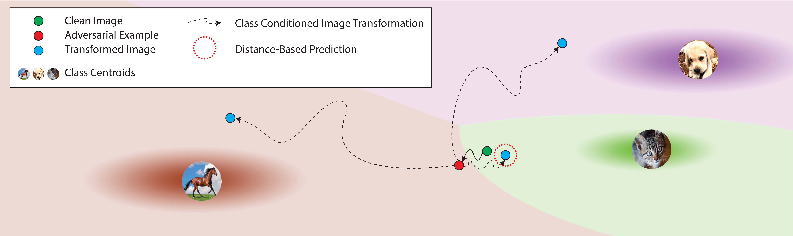
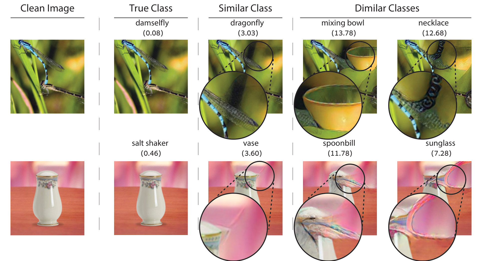

# [Class-Conditioned Transformation for Enhanced Robust Image Classification](https://arxiv.org/abs/2303.15409)

Authors: [Tsachi Blau](https://tsachiblau.github.io/),
[Roy Ganz](https://royg27.github.io/),
[Chaim Baskin](https://cris.bgu.ac.il/en/persons/chaim-baskin),
[Michael Elad](https://elad.cs.technion.ac.il/) and
[Alex M. Bronstein](https://bron.cs.technion.ac.il/)

---

Adversarial attacks pose a major challenge in computer vision, where small, nearly imperceptible modifications to input
images can mislead classifiers into making incorrect predictions. CODIP addresses this problem by enhancing the
robustness of adversarially trained (AT) models against both known and novel adversarial threats. The approach
introduces two primary mechanisms:

- **Conditional Transformation:** CODIP transforms input images towards different target classes and bases predictions
  on the class with the smallest semantic transformation distance.
- **Distance-Based Prediction:** By using the minimum transformation distance, CODIP improves model robustness without
  the need for additional training.



Below are qualitative examples demonstrating CODIP's effectiveness.



## Installation

1. Clone this repository:
    ```bash
    git clone https://github.com/yourusername/robust-image-classification
    cd robust-image-classification
    ```
2. Install Pytorch:
    ```bash
    conda install pytorch==2.1.2 torchvision==0.16.2 pytorch-cuda=12.1 -c pytorch -c nvidia
    ```

3. Install dependencies:
    ```bash
    pip install -r requirements.txt
    ```

## Usage

This repository supports two main flows:

### Evaluating Performance with CODIP

This flow applies CODIP to evaluate the robustness of adversarially trained (AT) models against adversarial attacks.
The evaluation can be configured with different attack types, including:

- **PGD Attack**: Can be used with either the L2 or Linf norm for adversarial perturbations.
- **AutoAttack**: Pre-generated adversarial examples can be loaded from a saved file for consistent evaluation.

This evaluation flow can be run by setting `--flow eval` in the command line and specifying the attack parameters.

Example:

```bash
python main.py --flow eval \
--dataset cifar10 \
--model_path path_to_model \
--attack_threat_model L2 \
--attack_epsilon 0.5 \
--attack_num_steps 20
```

### Creating Attacked Images using AutoAttack

This flow generates adversarial examples for a specified dataset using the AutoAttack framework and saves them for later
evaluation. This is useful for testing robustness against pre-generated attacks, as the saved adversarial examples can
be reloaded for consistent evaluation.

To run this flow, set `--flow create_aa` in the command line, along with specifying paths for saving the adversarial
examples and labels.

Example:

```bash
python main.py --flow create_aa \
--dataset cifar10 \
--model_path path_to_model \
--aa_dataset_path path_to_aa_dataset \
--aa_labels_path path_to_aa_dataset_labels \
--attack_threat_model L2 \
--attack_epsilon 0.5 
```

### Parameters

#### General

- `--model_path`: Path to the pretrained model.
- `--dataset`: Specify the dataset (`cifar10`, `cifar100`, `imagenet`). <br>
- `--model_path`: Specify the path of the model
-

#### Attack

- `--attack_threat_model`: can be set to L2 or Linf
- `--attack_epsilon`: Perturbation epsilon for adversarial attack.**
- `--attack_num_steps`: Number of attack steps
- `--aa_dataset_path`: Specify the path to the autoAttack dataset
- `--aa_labels_path`: Specify the path to the autoAttack dataset labels

#### CODIP

- `--defense_alpha`: Choose the defense method (`CODIP`, `None`, etc.).
- `--defense_gamma`: Choose the defense method (`CODIP`, `None`, etc.).
- `--defense_num_steps`: Choose the defense method (`CODIP`, `None`, etc.).
- `--speed_up_ktop`: Choose the defense method (`CODIP`, `None`, etc.).

## Main Results


## Citation

If you find this work helpful, please consider citing our paper:

```bibtex
@article{blau2023codip,
  title={Class-Conditioned Transformation for Enhanced Robust Image Classification},
  author={Blau, Tsachi and Ganz, Roy and Baskin, Chaim and Elad, Michael and Bronstein, Alex M.},
  journal={arXiv preprint arXiv:2303.15409},
  year={2023}
}
```


